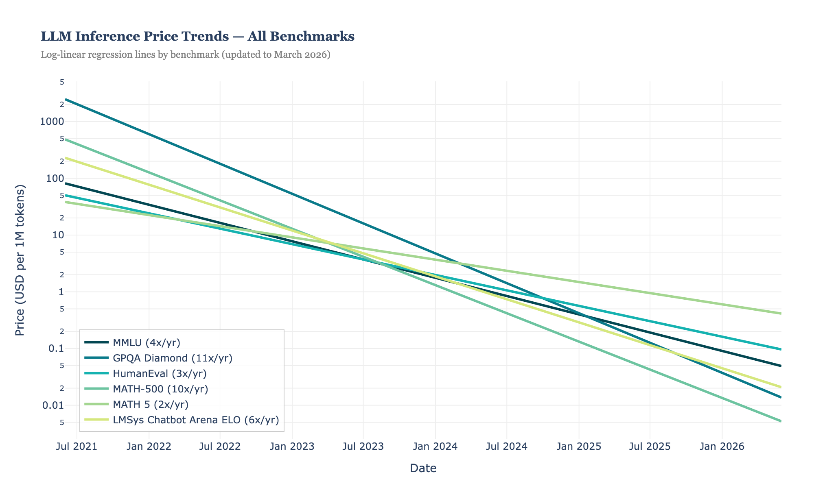
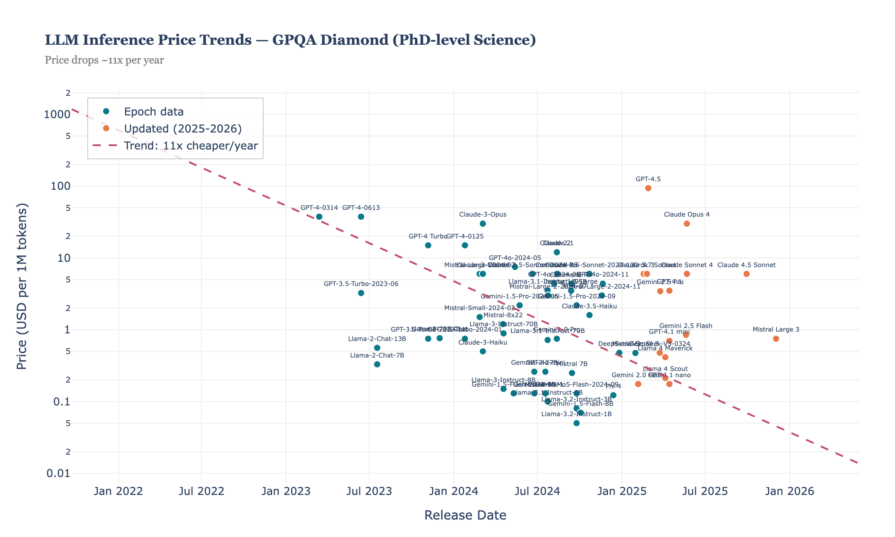
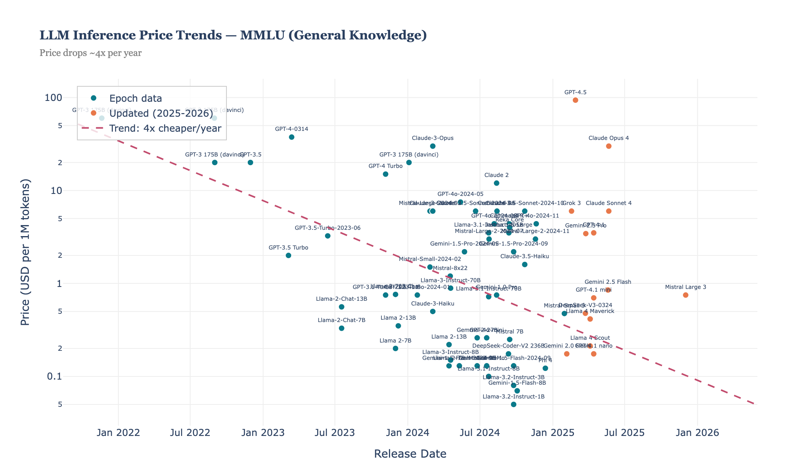

# LLM Inference Price Trends (Updated to March 2026)

Reproduction and extension of [Epoch AI's LLM Inference Price Trends](https://epoch.ai/data-insights/llm-inference-price-trends) analysis.

## Key Findings

| Benchmark | Price Decline Rate | Data Points |
|---|---|---|
| MMLU (General Knowledge) | ~4x cheaper/year | 72 |
| GPQA Diamond (PhD-level Science) | ~11x cheaper/year | 66 |
| HumanEval (Coding) | ~4x cheaper/year | 54 |
| MATH-500 | ~10x cheaper/year | 44 |
| MATH Level 5 (Advanced Math) | ~3x cheaper/year | 47 |
| LMSys Chatbot Arena ELO | ~6x cheaper/year | 50 |

**Median price decline: ~5x per year** across all benchmarks.

## What's Included

- **90 models** (66 from Epoch AI original + 24 new/updated for 2025-2026)
- **Date range:** November 2021 — February 2026
- **6 benchmark-specific charts** + 1 combined overview
- Reasoning models (o1, o3, o4-mini, DeepSeek-R1) excluded per Epoch methodology

## New Models Added (2025-2026)

GPT-4.5, GPT-4.1 family, Claude 3.7/4/4.5/4.6 Sonnet, Claude Opus 4/4.1/4.5/4.6, Gemini 2.5 Pro/Flash, Llama 4 Scout/Maverick, DeepSeek-V3-0324/V3.2, Grok 3, Mistral Large 3, Qwen3, and more.

## Methodology

Following [Epoch AI's approach](https://github.com/epoch-research/llm-benchmark-efficiency):
1. Price = weighted average of input/output per 1M tokens (3:1 ratio)
2. For each benchmark, define performance thresholds at each new frontier
3. Track cheapest model achieving each threshold over time
4. Fit log-linear regression (log₁₀(price) vs. year)
5. Slope gives annual price decline factor

## Usage

```bash
cd llm-price-trends
python3 -m venv .venv && source .venv/bin/activate
pip install -r requirements.txt
python3 scripts/analyze_and_plot.py
```

Charts are saved to `output/charts/` as interactive HTML and PNG.

## Data Sources

- [Epoch AI / Artificial Analysis](https://github.com/epoch-research/llm-benchmark-efficiency) — original data
- Official provider pricing pages (OpenAI, Anthropic, Google, etc.)
- [ArtificialAnalysis.ai](https://artificialanalysis.ai) — cross-verification

## Charts

### Combined Overview


### GPQA Diamond (PhD-level Science) — 11x/year


### MMLU (General Knowledge) — 4x/year

